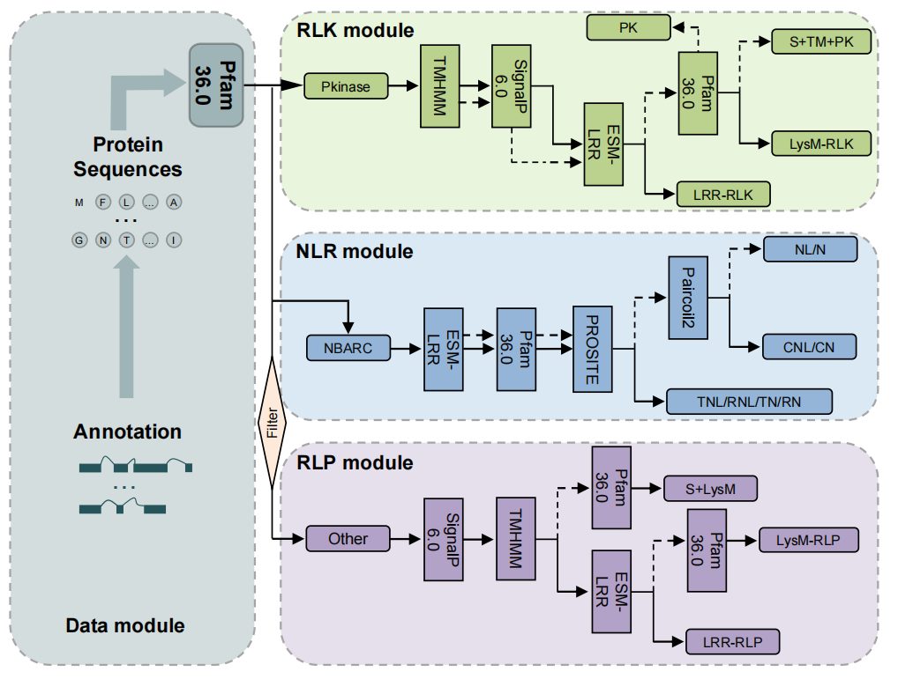

# R-Predictor
## Table of Contents
- [Introduction](#Introduction)
- [Installation](#Installation)
  - [Quick installation using Docker](#QuickinstallationusingDocker)
  - [Manual installation](#Manualintallation)
- [Inputs](#Inputs)
- [Outputs](#Outputs)
- [R-Predictor usage](#R-Predictorusage)
- [Citations](#Citations)
- [Acknowledgements](#Acknowledgements)
## Introduction
This pipeline is designed to automatically annotate 15 distinct domain topologies of disease resistance genes across the entire plant genome.

R-Predictor, designed for the de novo annotation of various R genes integrate four modules for data pre-processing and the identification of different types of proteins. Each module incorporates customized filtering scripts and the best-performing methods identified through benchmarking.

## Installation
There are several ways to install R-Predictor. You just need to find the best that works for your system.

### Quick installation using Docker
The Docker version of the R-Predictor will be released shortly!!!

### Manual installation
Manually installing R-Predictor can be cumbersome, but fortunately, these tools it depends on are easy to work with.
- [Pfam36.0](https://ftp.ebi.ac.uk/pub/databases/Pfam/releases/Pfam36.0/)
~~~
conda create -n pfam_scan
source activate pfam_scan
conda install -c bioconda pfam_scan hmmer hmmer2 -y
~~~
- [SignalP 6.0](https://github.com/fteufel/signalp-6.0/blob/main/installation_instructions.md)
~~~
conda create -n signalp
source activate signalp
conda install -c predector signalp6
signalp6-register signalp-6.0h.fast.tar.gz
~~~
- [TMHMM-2.0](https://services.healthtech.dtu.dk/cgi-bin/sw_request?software=tmhmm&version=2.0c&packageversion=2.0c&platform=Linux)
~~~
The installation details are as follows:
1.Click the hyperlink to download the installation package.
2.Modify the first line of the `tmhmm` in the bin folder to use your own perl path, which can be found by running `which perl`. On line 33, change $opt_basedir="./tmhmm-2.0c".
3.Modify the first line of the `tmhmmformat.pl` to use your own perl path.
~~~
- [ESM-1v](https://github.com/facebookresearch/esm/blob/main/README.md) and [model](https://dl.fbaipublicfiles.com/fair-esm/models/esm1v_t33_650M_UR90S_1.pt)
~~~
Download the ESM-1v model and move it to the `models` directory.
~~~
- [ESM-LRR](https://github.com/zhouyflab/R-Predictor/) and [model](https://drive.google.com/file/d/1_Dx_CD6lZLUBcfJIeosVLQwADGk_YNt-/view?usp=drive_link)
~~~
conda create -n ESM-LRR
Download the ESM-LRR model and move it to the `models` directory.
~~~
- [ProSite](https://ftp.expasy.org/databases/prosite/ps_scan/README)
~~~
source activate pfam_scan
conda install -c bioconda pftools
~~~
- [Paircoil2](https://cb.csail.mit.edu/paircoil2/)
~~~
Place the configuration file .paircoil2 in your home directory and the
executable and data files (*.tb) in the directory you will run Paircoil2 in.
~~~
**If the above tools cannot be installed via conda or downloaded from the official website, please go to the [tools](tools/) folder.**
## Input
R-Predictor supports single or multiple protein sequences, which should be in FASTA format.
~~~
>Q9XGM3
METSSISTVEDKPPQHQVFINFRGADLRRRFVSHLVTALKLNNINVFIDDYEDRGQPLDV
LLKRIEESKIVLAIFSGNYTESVWCVRELEKIKDCTDEGTLVAIPIFYKLEPSTVRDLKG
KFGDRFRSMAKGDERKKKWKEAFNLIPNIMGIIIDKKSVESEKVNEIVKAVKTALTGIPP
EGSHNAVVGALGNSNAGTSSGDKKHETFGNEQRLKDLEEKLDRDKYKGTRIIGVVGMPGI
GKTTLLKELYKTWQGKFSRHALIDQIRVKSKHLELDRLPQMLLGELSKLNHPHVDNLKDP
YSQLHERKVLVVLDDVSKREQIDALREILDWIKEGKEGSRVVIATSDMSLTNGLVDDTYM
~~~
**Ensure that the > lines in the FASTA file consist only of > followed by a unique ID for each protein, such as >Q9XGM3.**
## Output
R-Predictor will return 15 protein sequence files, each corresponding to a plant disease-resistance protein with a different domain topology.
~~~
/outcome
  xx_lrr_rlk.fasta
  xx_lysm_rlk.fasta
  xx_s_tm_pk.fasta
  xx_pk.fasta
  xx_lrr_rlp.fasta
  xx_lysm_rlp.fasta
  xx_s_lysm.fasta
  xx.cnl.fasta
  xx.cn.fasta
  xx.tnl.fasta
  xx.tn.fasta
  xx.rnl.fasta
  xx.rn.fasta
  xx.nl.fasta
  xx.n.fasta
~~~
## R-Predictor usage
Make the following modifications before running R-Predictor.  
1.Replace `/root/tool/tmhmm-2.0c/bin/tmhmm` in `Pfam_pk_nb.py` and `signal_rlk_rlp.py`with the correct path.  
2.Unzip the model files of ESM-1v and ESM-LRR, and move them to `models` directory.  
3.Replace `protein_path` and `work_path` in pipeline.py with the correct paths.  
4.Replace `cnl_path` and `cn_path` in pfam_tir_rpw8.py with the correct paths.
4.Download the [PfamA](https://drive.google.com/file/d/1BkmNB-4ujw8cIeTDWc-_GkXaUnU4Y3_j/view?usp=drive_link) database and move it to the `hmm` directory.  
**If you have correctly installed the required dependencies and modified the corresponding paths, R-Predictor will work smoothly.**  
~~~
python pipeline.py
~~~

## Citations
Deep learning facilitates precise identification of disease-resistance genes in plants
Zhenya Liu, Xu Wang, Shuo Cao, Tingyue Lei, Yifu Chenzhu, Mengyan Zhang, Zhongqi Liu, Jianzhong Lu, Wenqi Ma, Bingxiong Su, Yiwen Wang, Yongfeng Zhou
bioRxiv 2024.09.26.615248; doi: https://doi.org/10.1101/2024.09.26.615248
## Acknowledgements
This program would like to thank Professor Zhou and Professor Wang for their guidance, and express gratitude to Xu Wang, Tingyue Lei and Zhongqi Liu for their contributions.
